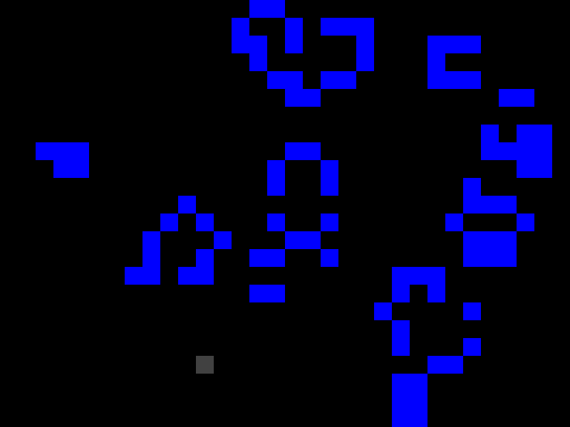

<div align="center">
<h1>game-of-life</h1>
  <p>
    <strong>
      Interactive implementation of <a href="https://en.wikipedia.org/wiki/Conway's_Game_of_Life">Conway's Game of Life</a> using <a href="http://ggez.rs/">ggez</a>
    </strong>
  </p>
  
</div>

## Installation

```sh
cargo run
```

## Controls

- Left-click spawns a cell
- Right-click kills a cell
- Space pauses and resumes the simulation
- Escape quits

## License

Licensed under either of

- Apache License, Version 2.0
  ([LICENSE-APACHE](LICENSE-APACHE) or http://www.apache.org/licenses/LICENSE-2.0)
- MIT license
  ([LICENSE-MIT](LICENSE-MIT) or http://opensource.org/licenses/MIT)

at your option.

## Contribution

Unless you explicitly state otherwise, any contribution intentionally submitted
for inclusion in the work by you, as defined in the Apache-2.0 license, shall be
dual licensed as above, without any additional terms or conditions.
